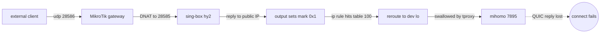

一台旁路由，既用 mihomo 做透明代理（tproxy）给全屋分流，又用 sing-box 在上面开了 hysteria2 入站给自己当节点。结果踩了两个坑：

1. **hy2 节点连不上**——本机回环能通、端口转发也对，但外部客户端死活握不上手；
2. 好不容易连上了，**网页正常、游戏却总是断**。

两个坑的根子是同一个：**这台机器自己的透明代理，把 hysteria2 服务端的「回包」和「出站」都吃掉了。** 本文完整复盘排障过程，并借此把 Linux 的 netfilter 钩子、fwmark 策略路由、TPROXY 原理、以及 nftables 的 socket/cgroup 匹配讲透。

<!--more -->

## 环境拓扑

先交代清楚谁是谁，这是看懂后面一切的前提：

- **网关**：MikroTik CCR1072，双线（电信 `sfp-ct` / 移动 `sfp-cmcc`），负责把公网入站 DNAT 给内网旁路由。
- **旁路由**：一台 Ubuntu（内核 6.8），内网 IP `10.0.0.13`，身上同时跑两类角色：
  - **出站方向（旁路由本职）**：`mihomo`（以 `clash` 用户 / **uid 995** 运行）用 nftables **TPROXY** 把全屋流量重定向到自己的 `:7895` 做分流。
  - **入站方向（当节点）**：`sing-box`（以 **root** 运行）开了一堆入站协议——hysteria2 `:28585`、tuic `:45362`、vless `:52740`、vmess `:2086`、anytls `:17806`。

参照物是早先一台**纯 hysteria 服务端** `10.0.10.111`：它只跑 hysteria，不做旁路由、不做 tproxy。后面会看到，正是「有没有 tproxy 这一层」造成了全部差异。

---

# 第一个坑：hy2 节点连不上

## 现象：能听、能回环、就是连不上

服务在跑、端口在听：

```bash
$ systemctl is-active sing-box
active
$ sudo ss -ulnp 'sport = :28585'
UNCONN 0 0 *:28585 *:* users:(("sing-box",pid=245190,fd=12))
```

在**本机**起一个临时 hy2 客户端连 `127.0.0.1:28585`，再用它的 SOCKS 口 curl 出网——**完美通过**，握手、认证、TLS、代理出网整条链路都对，服务端也记下了 `inbound connection from 127.0.0.1`。

可一旦换成**手机流量（真·外部客户端）**连，就连不上，而且服务端日志**一条外部连接都没有**。本机能通、外部为空，矛盾点很明确：要么入站没进来，要么回包没出去。**抓包。**

## 抓包：回包跑去了 `lo`

```bash
$ sudo tcpdump -ni any udp port 28585
```

```text
ens160 In   <client>.17840 > 10.0.0.13.28585: UDP, length 1200   ← 客户端的包，进来了！
lo     In   10.0.0.13.28585 > <client>.17840: UDP, length 1280   ← 服务端的回包，却跑去了 lo！
lo     In   10.0.0.13.28585 > <client>.17840: UDP, length 688
...
```

两个事实：**入站是好的**（`ens160 In`，DNAT 后客户端的 QUIC Initial 确实到了）；**回包出不去**——sing-box 生成的握手响应，出口接口是 **`lo`（回环）** 而不是 `ens160`。回包被丢进回环，客户端永远收不到，QUIC 握手完不成，连接自然建立不起来，sing-box 也就不打印日志。

要理解「为什么回包会跑去 lo」，得先补一段 Linux 网络原理。

---

## 插播：Linux 网络原理——tproxy、fwmark 与策略路由

透明代理（tproxy）能「凭空把别人的流量塞进自己」，靠的是内核三件套：**netfilter 钩子** + **fwmark** + **策略路由**。

### 1. 数据包在内核里的旅程与 netfilter 钩子

一个包进出内核会经过几个固定的「钩子点」，nftables/iptables 就挂在这些点上做手脚：

```text
  NIC rx ──► prerouting ──► [ routing decision ]
                                   │
                   ┌───────────────┴───────────────┐
              for this host                     to forward
                   │                                 │
                 input                               │
                   │                                 │
             local process                           │
                   │                                 │
                 output                              │
          (replies & egress start here)              │
                   │                                 │
                   └───────────────┬─────────────────┘
                                   ▼
                             postrouting ──► NIC tx
```

- **prerouting**：所有「进来的」包（含要转发的）第一个经过的点。透明代理拦截**转发流量**就在这里。
- **output**：本机进程**自己发出**的包经过的点。注意——**sing-box 给客户端的回包、以及 sing-box 代理客户端访问外网的出站，都属于「本机发出」，都会过 output。** 这是后面两个坑的共同入口。

nftables 的 base chain 用 `hook` + `priority` 定位。同一个钩子上可以挂多条 base chain，按 **priority 数字从小到大**依次执行。还有个关键类型 **`type route` 的 output 链**：如果它**改了包的 fwmark 或目的地址，内核会重新做一次路由判定**——这正是把包「改道」去回环的扳手。

### 2. 策略路由：不止一张路由表

很多人以为 Linux 只有一张路由表（`main`）。其实内核支持**多张路由表**，由 **`ip rule`（策略规则）**决定某个包该查哪张表。规则按优先级从上往下匹配，可以按**源地址、fwmark、入接口**等条件选表：

```bash
$ ip rule
0:      from all lookup local
100:    from all fwmark 0x1 lookup 100      # ← 带 mark 0x1 的包,改查"表 100"
32766:  from all lookup main
```

### 3. fwmark + `dev lo` 这套 TPROXY 戏法

mihomo 透明代理的核心，就是把「该代理的包」打上 `fwmark 0x1`，再用策略路由把它们导进一张特殊的表：

```bash
$ ip route show table 100
local default dev lo scope host        # ← 默认路由指向回环,且是 "local"
```

`local default dev lo` 的意思是：**把这些包当作「本机本地交付」，从回环口 `lo` 收下来**。于是 mihomo 监听在 `:7895` 的 TPROXY socket 就能在回环上接到这些「本不属于它」的包，完成透明代理。

把链路串起来，mihomo 的 nftables 是这样工作的（两条腿）：

- **转发的 LAN 流量** → 在 **prerouting** 直接 `tproxy to :7895`；
- **本机自己发出的流量** → 在 **output** 打 `mark 0x1` → 命中 `ip rule 100` → 查表 100 → `dev lo` → 回环上被 tproxy 收走。

看它的 output 链（精简）：

```text
table inet mihomo_tproxy_local {
    chain output {
        type route hook output priority mangle; policy accept;
        meta skuid 995 ... return                              # ① mihomo 自己(clash 用户)放行,防自环
        ip daddr { 10.0.0.0/8, 127.0.0.0/8, 192.168.0.0/16, ... } return   # ② 目的是私网/回环,放行
        meta l4proto { tcp, udp } ... meta mark set 0x00000001             # ③ 其余一律打 mark 0x1
    }
}
```

### 4. socket 匹配：按进程（uid / cgroup）放行

第 ① 条 `meta skuid 995 return` 用到了 nftables 的 **`socket` 匹配能力**：内核可以反查「这个包属于哪个本地 socket」，从而知道它的**属主 uid、甚至所属 cgroup**。mihomo 正是用 `skuid 995`（自己的 `clash` 用户）给自己放行，避免代理自己的流量造成死循环。**记住这个机制——后面我们修复时也要靠它。**

---

## 第一个坑的根因

现在回头看回包为什么跑去 lo，一切都顺了。看 output 链的豁免名单，只放行两类包：

- `skuid 995`（mihomo 自己）；
- 目的地是**私网/回环**的包。

而 **sing-box 是以 root（uid 0）运行的**：它发往**公网客户端**的回包，既不是 uid 995，目的地也不是私网——于是结结实实落进第 ③ 条，被打上 `mark 0x1`，然后顺着 `ip rule 100 → 表 100 → dev lo` 被导进回环，灌回了 mihomo。



这也解释了「**回环测试能通、外部就不行**」：回环回包目的地是 `127.0.0.1`，正好被第 ② 条**私网放行**豁免，根本不会被打标记。一个测试方法的盲区，差点把人带沟里。

## 修复一：用独立 nft 表把回包放出去

思路：让服务端回包**绕开 mihomo 的 output 标记**。关键原则——**绝不动 mihomo 的表，也不影响全屋透明代理**。所以新建**一张完全独立的 nft 表**，挂在 output 钩子上、优先级排在 mihomo **之后**（`mangle + 10`，利用前面讲的「`type route` 改了 mark 会重新路由」），把这些入站监听端口的回包 `mark` 清零：

```bash
table inet hy2fix {
    chain out {
        type route hook output priority mangle + 10; policy accept;
        udp sport { 28585, 10443, 45362 } meta mark set 0x00000000
        tcp sport { 52740, 2086, 17806 } meta mark set 0x00000000
    }
}
```

mark 归零后，包不再命中 `ip rule 100`，落回 `main` 表正常路由——从 `ens160` 发给网关，对称回到客户端。改完抓包，回包从 `lo` 变成了 `ens160 Out`，hy2 节点连上了。

> 这只匹配「源端口是服务端口」的本机出站包；全屋转发流量走 prerouting，与这条链毫无交集，**透明代理零影响**。

---

# 第二个坑：连上了，游戏却总断

hy2 节点能用之后，新问题来了：**访问 Google / YouTube 正常，一打游戏（部落冲突）就频繁断线**。而早先那台纯 hy 服务端 `10.0.10.111` 打游戏一点事没有。

## 抓包：游戏出站被二次代理

先看 hy2 客户端在访问哪些目的地：

```text
hy2-sb: inbound connection to game.clashofclans.com:9339      ← 部落冲突游戏服
hy2-sb: inbound connection to clashofclans.inbox.supercell.com:443
hy2-sb: inbound connection to www.reddit.com:443             ← 也有翻墙流量
```

再抓 `lo`，看到大量 **RST（连接重置）**飞向台湾 HiNet / 亚洲游戏服务器：

```text
10.0.0.13.35068 > 119.147.126.235.443: Flags [R]
10.0.0.13.49044 > 211.75.210.74.443:  Flags [R]   (HiNet 台湾)
...（成片重置）
```

再用 `ip route get` 把机制坐实（这就是上面讲的策略路由）：

```bash
$ ip route get 8.8.8.8 mark 0x1
local 8.8.8.8 dev lo table 100 ...      # 带 mark → 进回环 → mihomo → 走香港
$ ip route get 8.8.8.8
8.8.8.8 via 10.0.0.1 dev ens160 ...     # 不带 mark → 直连(我们想要的)
```

## 第二个坑的根因

道理和第一个坑同源，只是这次是**出站方向**：sing-box 替 hy2 客户端访问外网时，发出的包**源端口是随机高位口**（不在我们 `hy2fix` 的 sport 名单里），又是 root 发出、目的是公网——于是再次被 mihomo 的 output 打 `mark 0x1`，导回环、灌进 mihomo，被**当成本机出站流量套用旁路由的分流规则**：

```yaml
# mihomo 配置
- DOMAIN-SUFFIX,clashofclans.com,Game     # 游戏 → "Game" 组(海外节点)
- DOMAIN-SUFFIX,supercell.com,Game
- MATCH,国外                               # 其余 → "国外" 组(海外节点)
```

于是出现了荒唐的多重套娃：

| 流量 | mihomo 判给 | 实际路径 | 结果 |
|------|------------|----------|------|
| reddit / google | `国外`→海外节点 | client→hy2→**box→香港→站点** | 网页能忍受多跳 ✅ |
| **game.clashofclans.com:9339** | `Game`→海外节点 | client→hy2→**box→香港→台湾游戏服** | 实时游戏被延迟/绕路搞崩，**RST 断开** ❌ |

**纯 hy 服务端 `10.0.10.111` 没有 mihomo 这一层，sing-box 直接出网，游戏流量原样直连 → 正常。** 而这台 `10.0.0.13` 因为兼任旁路由，sing-box 的出站被自己的透明代理劫持二次分流，这就是冲突根源。

## 修复二：按 cgroup 让 sing-box 整体直连出网

第一个坑只放行了「回包」（按 sport）；要修游戏，得让 **sing-box 的全部流量（含随机端口的出站）**都绕开 mihomo。出站端口是随机的，没法按 sport 匹配——这时就轮到前面讲的 **socket cgroup 匹配**登场了。

sing-box 由 systemd 拉起，它的所有 socket 都归属 cgroup `system.slice/sing-box.service`。在我们那张独立表里加一条「按服务 cgroup 整体清 mark」：

```bash
table inet hy2fix {
    chain out {
        type route hook output priority mangle + 10; policy accept;
        # 回包(稳定的 sport 匹配,保证握手永远能回)
        udp sport { 28585, 10443, 45362 } meta mark set 0x00000000
        tcp sport { 52740, 2086, 17806 } meta mark set 0x00000000
        # sing-box 全量流量 → 直连出网(修游戏),按服务 cgroup 匹配
        socket cgroupv2 level 2 "system.slice/sing-box.service" meta mark set 0x00000000
    }
}
```

这样 sing-box 的出站包也被清掉 mark → 走 `main` 表 → 从 `ens160` 直连出网，行为和纯 hy 服务端一致。抓包验证：sing-box 出公网 **2060 包全走 `ens160 Out`**，cgroup 命中数持续上涨，游戏 RST 消失。

> **这个方案的代价（要想清楚再用）**：sing-box 出站既然整体直连，那么**通过这个节点访问被墙网站也会走国内直连 → 打不开**。所以这个节点的定位就变成了「国内/游戏直连出口」；要翻墙，在客户端把那些站走**另一个海外节点**即可。

### cgroup 匹配的一个坑：会随服务重启失效

`socket cgroupv2` 的 cgroup id 是在 **nft 加载规则那一刻**解析的；一旦 `sing-box.service` 重启，cgroup id 变了，旧规则就匹配不到了。解决办法是把持久化服务和 sing-box **绑定重启**：

```ini
# /etc/systemd/system/hy2fix.service
[Unit]
Description=hy2fix - keep inbound servers off mihomo tproxy
After=network-online.target sing-box.service
Wants=network-online.target
PartOf=sing-box.service          # ← sing-box 重启时,本服务跟着重启,重新解析 cgroup

[Service]
Type=oneshot
ExecStart=/usr/sbin/nft -f /etc/hy2fix.nft
RemainAfterExit=yes

[Install]
WantedBy=multi-user.target
```

把那张表写进 `/etc/hy2fix.nft`，`systemctl enable hy2fix.service` 开机自启即可。它是独立表，mihomo 重启重建自己的表时也不会碰它。

---

## 几条教训

1. **在 tproxy 机器上开入站服务，天生会撞上"被自己代理"的问题。** 透明代理为了重定向「本机出站」，会在 output 上给流量打标记并改路由；你的服务端**回包**和**代理出站**都是「本机出站」，不在豁免名单里就会被一起带走。回包被带走 → 连不上；出站被带走 → 被二次分流，游戏崩。
2. **回环测试 ≠ 外部测试。** 回环回包目的地是 `127/8`，正好落在 tproxy 的私网放行规则里，会给你「服务没问题」的错觉。判断入站服务到底通不通，要么从真正的外部客户端测，要么直接抓包看回包接口。
3. **抓包看 `In`/`Out` 接口是定位这类问题的金标准。** `lo In` 而非 `ens160 Out` 这一个细节，直接锁定「回包/出站被导去回环」，省掉所有猜测。
4. **修复要做减法、按进程身份精准放行。** 独立一张表，按 **sport**（稳定）保回包、按 **cgroup**（覆盖随机端口）保出站，既不碰 mihomo 又重启不丢。理解 fwmark/策略路由/socket 匹配这套机制，才能开出这种"外科手术式"的药方。

> 排障路上还踩过一个坑：一度根据 MikroTik `/ip cloud` 显示的公网地址和接口 IP 不一致，误判移动线是 CGNAT、入站不可达。后来抓包证明入站完全正常——`/ip cloud` 反映的是路由器**自身出站**被策略路由后的出口，不能拿它单独判定一条线能不能入站。**结论永远以抓包为准。**
