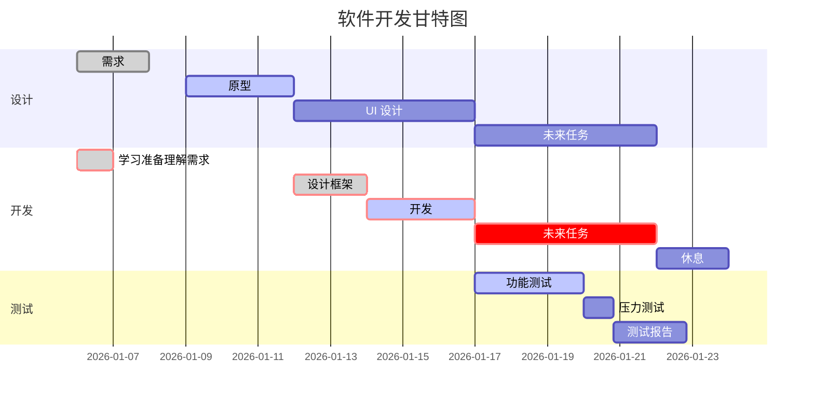
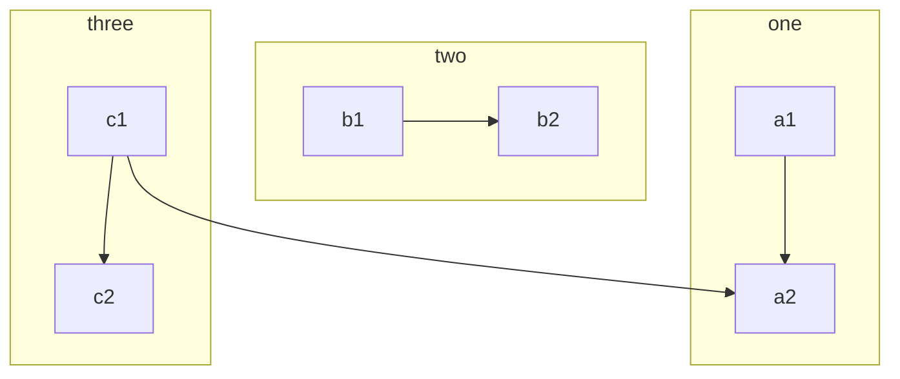

旧文整理：使用纯 ASCII 字符绘制图形，在 2024 年，已经很少人能用到这些工具了吧，常见于一些规范、协议、linux 帮助文档，采用的都是纯文本形式编写。之前写博客被图床困扰，遂使用纯 ASCII 替换部分简图。

<!-- more -->

## 示例

```bash
+---+     +---+     +---+
| A | --> | C | --> | D |
+---+     +---+     +---+
            |
            |
            v
          +---+
          | E |
          +---+
               .................
               v               :
+------+     +---------+     +---------+     +---------+     +--------------+
| Task | --> | Created | --> | Audit 1 | --> | Audit 2 | --> | Execute Task |
+------+     +---------+     +---------+     +---------+     +--------------+
               ^                               :
               .................................
```


优点：兼容性强，可以在任意显示 ASCII 的设备上展示图形，占用空间极小
缺点：只能绘制简单、单一的图形


## [Graph-Easy](https://github.com/ironcamel/Graph-Easy)

能够将 DOT（一种文本图形描述语言）文件转换成 ASCII、HTML、SVG 图片

### 示例

```bash
# DOT 文本：[hello]->[world]

+-------+     +-------+
| hello | --> | world |
+-------+     +-------+

# DOT 文本

[ Client ]{rows:8;} -- (A) Authorizatoin Request --> [ 1.Resource Owner ]{rows:2;}
[ 1.Resource Owner ] -- (B) Authorizatoin Grant --> [ Client ]
[ Client ] -- (C) Authorizatoin Request --> [ 2.Authorizatoin Server ]{rows:2;}
[ 2.Authorizatoin Server ] -- (D) Access Token --> [ Client ]
[ Client ] -- (E) Access Token --> [ 3.Resource Server ]{rows:2;}
[ 3.Resource Server ] -- (F) Protected Resource --> [ Client ]

# 渲染后

+--------+  (A) Authorizatoin Request   +------------------------+
|        | ---------------------------> |                        |
|        |                              |    1.Resource Owner    |
|        |  (B) Authorizatoin Grant     |                        |
|        | <--------------------------- |                        |
|        |                              +------------------------+
|        |  (C) Authorizatoin Request   +------------------------+
|        | ---------------------------> |                        |
| Client |                              | 2.Authorizatoin Server |
|        |  (D) Access Token            |                        |
|        | <--------------------------- |                        |
|        |                              +------------------------+
|        |  (E) Access Token            +------------------------+
|        | ---------------------------> |                        |
|        |                              |   3.Resource Server    |
|        |  (F) Protected Resource      |                        |
|        | <--------------------------- |                        |
+--------+                              +------------------------+
```

## [Drawit](https://github.com/vim-scripts/DrawIt)

vim 插件，可以绘制 ASCII 图形

### 使用

`\di` 进入 drawit 模式，`\ds` 退出

### 功能

| 按键和指令        | 作用                            |
| ----------------- | ------------------------------- |
| left              | 向左绘制                        |
| right             | 向右绘制                        |
| up                | 向上绘制                        |
| down              | 向下绘制                        |
| h                 | 左移动                          |
| j                 | 下移动                          |
| k                 | 上                              |
| l                 | 右                              |
| space             | 橡皮擦模式                      |
| PD                | 右下绘制                        |
| PU                | 左下绘制                        |
| HOME              | 左上绘制                        |
| END               | 右上绘制                        |
| v, <, >, ^        | 四个箭头                        |
| \v, \\<, \\>, \^  | 四个粗箭头                      |
| crtl+v / 鼠标拖动 | 进入 visible 模式               |
| \l                | 在 visible 模式下，对选择块画线 |
| \a                | 呈上，画带箭头的线              |
| \b                | 对选择块画盒子                  |
| \e                | 对选择块画椭圆                  |
| \f 字符           | 以字符填充光标区域              |
| \r 字符           | 以字符填充选择块填充            |

## Convert To ASCII Art

VSCode 插件，能够将字符转换成 ASCII 大图

```bash
The cake
is a lie!
████████╗██╗  ██╗███████╗     ██████╗ █████╗ ██╗  ██╗███████╗
╚══██╔══╝██║  ██║██╔════╝    ██╔════╝██╔══██╗██║ ██╔╝██╔════╝
   ██║   ███████║█████╗      ██║     ███████║█████╔╝ █████╗
   ██║   ██╔══██║██╔══╝      ██║     ██╔══██║██╔═██╗ ██╔══╝
   ██║   ██║  ██║███████╗    ╚██████╗██║  ██║██║  ██╗███████╗
   ╚═╝   ╚═╝  ╚═╝╚══════╝     ╚═════╝╚═╝  ╚═╝╚═╝  ╚═╝╚══════╝

██╗███████╗     █████╗     ██╗     ██╗███████╗██╗
██║██╔════╝    ██╔══██╗    ██║     ██║██╔════╝██║
██║███████╗    ███████║    ██║     ██║█████╗  ██║
██║╚════██║    ██╔══██║    ██║     ██║██╔══╝  ╚═╝
██║███████║    ██║  ██║    ███████╗██║███████╗██╗
╚═╝╚══════╝    ╚═╝  ╚═╝    ╚══════╝╚═╝╚══════╝╚═╝
```

## toilet or figlet

可以将普通的文本转换成各种艺术字

### 安装方法

```bash
# 这里只演示 Archlinux，其他系统请查看官网

sudo pacman -S toilet
sudo pacman -S figlet
```

### 示例


## Asciiflow2

VSCode 插件，能够在 VSCode 里面使用鼠标绘制 ASCII 图形

## [Mermaid](https://mermaid.js.org)

Mermaid 不能生成 ASCII 图片，但也是一个好用的文本渲染图片工具，配合 AI 使用非常方便。





## 总结

现在程序语言里面有很多内置模块能够将对象用 ASCII 字符体现出来，比如 python-tabulate，相对自己写输出来说也要直观不少，在以前哪个年代，纯 ASCII 字符绘制的图形也是挺炫酷的。


参考文章 [如何制作纯 ASCII 文本流程图](https://www.digglife.net/articles/ascii-flowchart-how-to.html)
