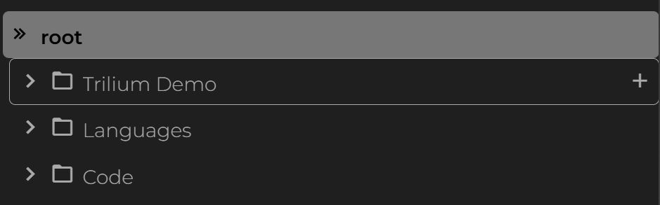
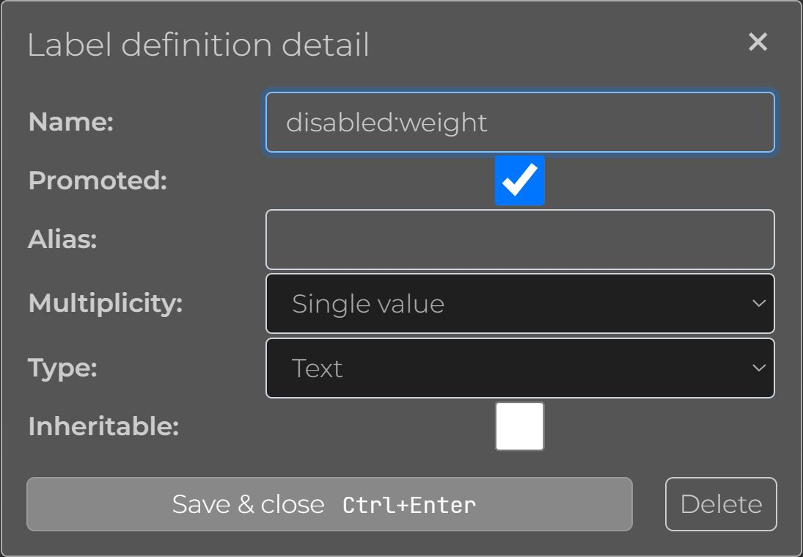
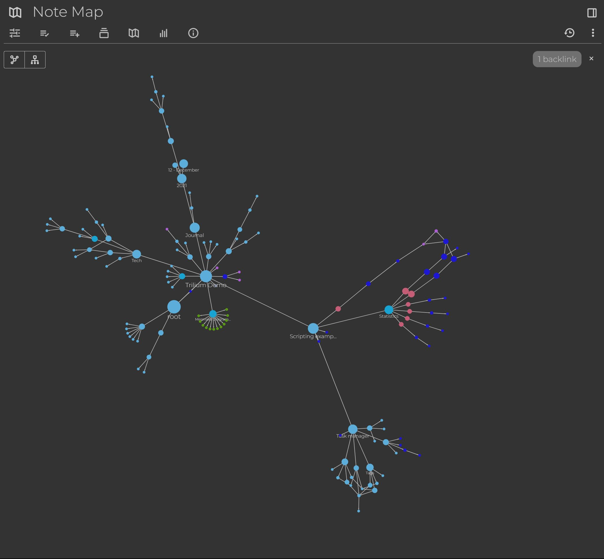

Trilium Notes 开源、跨平台的个人笔记管理软件，可以方便结构化的管理大量笔记，层级无限制，支持多种笔记类型，非常适合用来管理自己的日记、笔记、工作等信息。

<!-- more -->

## 前言

从第一接触 Markdown 开始，我就一直使用 Markdown 做笔记，后面将所有笔记都写在 Hexo 部署在 Github 上，缺点就是不够隐私。在大学看到同学使用 Notion 做笔记，我也眼馋它对笔记的各种整合，但是因为付费 + 闭源的原因，我还是坚持使用 typora 写笔记。

在 Github 接触到了 Mrdoc（觅思文档），国人写的在线文档系统，分为开源版和付费版，具有多人写作、版本控制、多平台、导入导出等功能，于是我就将我之前的所有笔记迁移到了 Mrdoc，还买了阿里云的服务器部署，方便实时访问。

随着笔记和想学的内容的增加，我认为开源版 Mrdoc 已经不适合做笔记（层级有限、笔记类型太少），对于我来说就是一个方便管理 md 文件的地方，没有额外的笔记功能。

之前就已经注意了了 Trilium，但是一直没用时间迁移过来，忙着毕业和找工作。现在工作稳定了，为了更方便的学习知识，将博客和笔记分开记录，博客使用 Hexo，笔记使用 Trilium，数据备份到坚果云。接下来开始正式介绍、使用 Trilium。


请注意，本文只是介绍 Trilium 的优点和我查阅官方 Wiki 对它的理解，不涉及安装教程。
因为 Trilium 已经进入维护阶段，版本停留在了 0.63，我使用的是 Triliumnext，官方仓库在这 <https://github.com/TriliumNext/>
相较原版，支持多语言，用 TS 重构，可自定义菜单栏。


## Trilium 简介


Trilium 是一款开源的、跨平台的笔记和知识管理应用程序，可以帮助用户高效地组织和管理信息。Trilium 采用树形结构来组织笔记，支持丰富的文本格式、嵌入各种媒体文件、自定义元数据，功能强大且灵活，非常适合用来管理个人笔记。下面我分层次解释 Trilium 的特点。

## 基础功能

### 笔记

所有笔记都在 root 下，以树形放置



Trilium 支持以下类型的笔记

- 文本（使用 CKEditor）
- 代码
- 图像
- 文件
- HTML
- 关系图
- 读书笔记（针对一本书进行记录）
- Canvas
- Mermaid
- 思维导图（Mind Map）
- 归档


### 多层级

Trilium 支持无限层级，所有笔记都被视为同等重要的实体，不论哪个节点，都可以是笔记 / 目录，目的是为了将内容和结构进行分离，方便进行动态链接。

### 克隆笔记

能够将一个节点放在不同的父级下，类似操作系统的 **硬链接**，官方称之为 **Cloning（克隆）**，但是实际上多了个引用，并不是真正的复制一份文件。

### 隐私笔记

Trilium 支持将笔记内容加密，就算被获取了所有笔记，没有你设置的密码也无法获取笔记内容。

加密的只是笔记内容，对于笔记的元数据和结构这些无法加密。

## 高级功能

### [属性](https://triliumnext.github.io/Docs/Wiki/attributes.html)

在 Trilium 里面，笔记具有属性，为笔记提供元数据和特殊的功能，属性支持继承。

Trilium 的属性有两种类型

- Realtions：定义笔记之间的关系，如文章笔记和作者笔记关联，有点类似关系图
- Lables：键值对，可以自己定义。Trilium 内置了一些 Lables，可以对笔记进行特殊的处理，具体如下

内置的 Lables

- disableVersioning：禁用自动版本控制，非常适合大型、不重要的注释，例如脚本库
- calendarRoot：将笔记标记为每日笔记的根。只有一个笔记应带有此标签
- archived：隐藏默认搜索结果和对话框中的注释
- excludeFromExport：从导出操作中排除注释及其子树
- run：指定触发脚本的事件（可以指定 frontendStartup，backendStartup，mobileStartup，hourly，daily）
- runOnXXX：触发 [事件](https://triliumnext.github.io/Docs/Wiki/events.html)
- runAtHour：定义脚本运行的具体时间，和 #run=hourly 一起使用
- disableInclusion：防止脚本被包含在父脚本执行中
- sorted：自动按标题字母顺序对子笔记进行排序
- top：将注释保留在其父列表的顶部，适用于 sorted
- hidePromotedAttributes：隐藏笔记显示中的某些属性
- readOnly：将注释设置为只读模式，适用于文本和代码注释
- autoReadOnlyDisabled：禁用大型笔记的自动只读模式
- appCss：标记用于修改 Trilium 外观的 CSS 注释
- appTheme：标记 Trilium 选项中提供的完整 CSS 主题
- cssClass：向树中的注释表示添加 CSS 类
- iconClass：向笔记图标添加 CSS 类，有助于在视觉上区分笔记。
- pageSize：指定笔记列表中每页的项目数
- customRequestHandler 和 customResourceProvider：给用户自定义 JS 脚本
- widget：将注释标记为自定义小部件，并添加到 Trilium 的组件树中
- workspace 及相关属性：分离目录，比如办公和学习区
- searchHome：指定新搜索注释的父级
- inbox：指定通过侧边栏创建的新笔记的默认位置
- sqlConsoleHome：SQL 控制台注释的默认位置
- bookmarked 和 bookmarkFolder：添加后该文章会显示在侧边栏
- [shareXXX](https://triliumnext.github.io/Docs/Wiki/sharing.html)：分享文章，可以定义分享的样式、密码...
- keyboardShortcut：指定键盘快捷键来打开笔记
- displayRelations 和 hideRelations：管理注释关系的显示
- titleTemplate：设置创建新笔记的默认标题模板
- template：使笔记可用作模板
- toc：控制目录的可见性
- color：定义树和链接中注释的颜色
- hideChildrenOverview：在父注释的编辑器中隐藏子注释
- viewType：设置子笔记的视图（网格或列表）


属性并没有展示完整，Trilium 扩展性很强，可以自己编写脚本笔记指定某个属性去做什么。


### Promoted 属性

Trilium 给用户自定义的一种属性，被赋予 Promoted 属性的笔记或标签会在列表中优先显示，通常位于列表的顶部。



这个属性用户必须定义了才能使用，如上图所示，该属性可以设置是否多值，类型支持 文本、数字、布尔值、Date、Date time、Url。

定义好以后，在需要使用的笔记（节点）加上属性，就会出现在笔记顶部


### 笔记关系图 Note Map



与笔记类型关系图类似，笔记关系图是自动生成的，代表各个笔记（节点）之间的关系

### 读书笔记

将笔记类型设置成 Book 后，Trilium 就会按顺序显示其子笔记的内容，从而营造出一种线性的、类似书本的阅读体验。这种格式对于以连贯、连续的方式查看多个较小的笔记特别有用。


### 在前端自定义部件

可以在界面上任意地方添加自定义小部件

- left-pane：树形栏
- center-pane：内容下方
- note-detail-pane
- right-pane

比如下面这个官方例子-统计字数小部件

```js
/*
 * This defines a custom widget which displays number of words and characters in a current text note.
 * To be activated for a given note, add label 'wordCount' to the note, you can also make it inheritable and thus activate it for the whole subtree.
 *
 * See it in action in "Books" and its subtree.
 */
const TPL = `<div style="padding: 10px; border-top: 1px solid var(--main-border-color); contain: none;">
    <strong>Word count: </strong>
    <span class="word-count"></span>

    &nbsp;

    <strong>Character count: </strong>
    <span class="character-count"></span>
</div>`;

class WordCountWidget extends api.NoteContextAwareWidget {
    static get parentWidget() { return 'center-pane'; }

    get position() { return 100; } // higher value means position towards the bottom/right

    isEnabled() {
        return super.isEnabled()
            && this.note.type === 'text'
            && this.note.hasLabel('wordCount');
    }

    doRender() {
        this.$widget = $(TPL);
        this.$wordCount = this.$widget.find('.word-count');
        this.$characterCount = this.$widget.find('.character-count');
        return this.$widget;
    }

    async refreshWithNote(note) {
        const {content} = await note.getNoteComplement();

        const text = $(content).text(); // get plain text only

        const counts = this.getCounts(text);

        this.$wordCount.text(counts.words);
        this.$characterCount.text(counts.characters);
    }

    getCounts(text) {
        const chunks = text
            .split(/[\s-+:,/\\]+/)
            .filter(chunk => chunk !== '');

        let words;

        if (chunks.length === 1 && chunks[0] === '') {
            words = 0;
        }
        else {
            words = chunks.length;
        }

        const characters = chunks.join('').length;

        return {words, characters};
    }

    async entitiesReloadedEvent({loadResults}) {
        if (loadResults.isNoteContentReloaded(this.noteId)) {
            this.refresh();
        }
    }
}

module.exports = WordCountWidget;
```

笔记的属性加上 `#widget`，重启前端，然后在需要的笔记属性上添加 `#wordCount`，效果如下图


### Day Note 日记

内置笔记（节点），以 `#calendarRoot` 标识，是官方针对日期型任务做的功能。


我打算把生活日志和学习打卡放在这里，相对比分成两个 markdown 文件记录要清晰很多。


### Render Note

Trilium 提供的一种特殊类型的笔记，它允许你将笔记的内容渲染成动态的 HTML 页面，配合上面的 Promoted 属性，可以完成一个体重 Tracker，如下所示


### TODO

官方编写的任务型脚本，用于管理 TODO，与日记集成，当添加 TODO 或者修改状态为 DONE 时，会自动把标题添加 TODO/DONE 前缀放在日记下。

## 总结

Trilium 是一款功能全面、易于使用、扩展性强的笔记软件。入门可能会被大量的专业术语迷惑，但是作者的理念我认为很适合做笔记，所有笔记都是平级，通过属性、链接关联在一起。

## 参考

<https://triliumnext.github.io/Docs/Wiki/patterns-of-personal-knowledge>

<https://triliumnext.github.io/Docs/>
